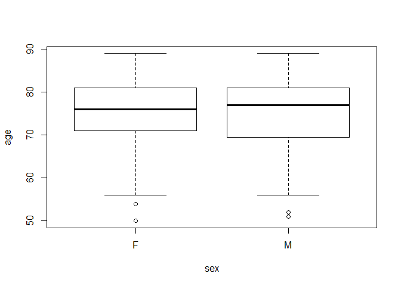

<!-- README.md is generated from README.Rmd. Please edit that file -->

# clinicalfd (Clinical Fake Data)

<!-- badges: start -->

<!-- badges: end -->

The goal of clinicalfd is to create Fake SDTM/ADaM data for generating
TFL.This data is available at
(<https://github.com/phuse-org/phuse-scripts>) for free to download for
public use see the licence here
(<https://github.com/phuse-org/phuse-scripts/blob/master/LICENSE.md>)

## Installation

You can install the released version of clinicalfd (clinical fake data)
from [Github](https://github.com/sas2r/clinical_fd)

General Instructions:

Make sure you have lateset version of R-language , the way to check is
session() . If it 0.4.7 then the Package may not be loaded. To take care
of that is

If you are R studio on Personnel drive then first Install.packages
(“rlang”) , then library (rlang) , check sessionInfo () NOTE: If you
are using Rstudio on cloud this may would not work , simply go to right
most corner of the window and change the R version to 4.0 or 4.1.

The way to install this package is In the R-studio in Console

install.packages(“devtools”) wait for the dev tools to be installed then
call the library(devtools). Once the devtools is installed then you can
call install\_github(“sas2r/clinical\_fd”) to install the package
clinical\_fd (all lower case , with the underscore in it ) then call
library(clincalfd) (without the underscore)

During the process of Installation ( May take around 10 min depending on
the System) you will see couple of packages either been downloaded or
updated.

NOTE: Make sure you type in exactly as shown below without \# for
install packages part

``` r
#install.packages("devtools") 

library(devtools)
#> Loading required package: usethis

#install_github("sas2r/clinical_fd")

library(clinicalfd)
## basic example code
```

Once you have the clinicalfd installed you can start calling the SDTM
datasets List of SDTM Data sets available in ‘clinicalfd’ package are:

ae  
cm  
dm  
ds  
ex  
lbch  
lbhe  
mh  
qsco  
qsda  
qsgi  
qshi  
relrec  
sc  
se  
suppae  
suppdm  
suppds  
supplbch  
supplbur  
sv  
ta  
te  
ti  
ts  
tv  
vs

## Example

This is a basic example which shows you how to solve a common problem:

``` r
summary(dm)
#>          studyid    domain     usubjid             subjid         
#>  CDISCPILOT01:306   DM:306   Length:306         Length:306        
#>                              Class1:labelled    Class1:labelled   
#>                              Class2:character   Class2:character  
#>                              Mode  :character   Mode  :character  
#>                                                                   
#>                                                                   
#>                                                                   
#>    rfstdtc            rfendtc            rfxstdtc           rfxendtc        
#>  Length:306         Length:306         Length:306         Length:306        
#>  Class1:labelled    Class1:labelled    Class1:labelled    Class1:labelled   
#>  Class2:character   Class2:character   Class2:character   Class2:character  
#>  Mode  :character   Mode  :character   Mode  :character   Mode  :character  
#>                                                                             
#>                                                                             
#>                                                                             
#>  rficdtc   rfpendtc                dthdtc    dthfl       siteid   
#>  :306    Length:306                   :303    :303   701    : 51  
#>          Class1:labelled    2013-01-14:  1   Y:  3   710    : 38  
#>          Class2:character   2013-08-02:  1           708    : 32  
#>          Mode  :character   2014-11-01:  1           716    : 29  
#>                                                      704    : 25  
#>                                                      709    : 23  
#>                                                      (Other):108  
#>       age           ageu     sex                                   race    
#>  Min.   :50.00   YEARS:306   F:179   AMERICAN INDIAN OR ALASKA NATIVE:  2  
#>  1st Qu.:70.25               M:127   ASIAN                           :  2  
#>  Median :77.00                       BLACK OR AFRICAN AMERICAN       : 29  
#>  Mean   :75.09                       WHITE                           :273  
#>  3rd Qu.:81.00                                                             
#>  Max.   :89.00                                                             
#>                                                                            
#>                     ethnic         armcd                      arm    
#>  HISPANIC OR LATINO    : 17   Pbo     :86   Placebo             :86  
#>  NOT HISPANIC OR LATINO:289   Scrnfail:52   Screen Failure      :52  
#>                               Xan_Hi  :84   Xanomeline High Dose:84  
#>                               Xan_Lo  :84   Xanomeline Low Dose :84  
#>                                                                      
#>                                                                      
#>                                                                      
#>      actarmcd                   actarm   country      dmdtc          
#>  Pbo     :86   Placebo             :86   USA:306   Length:306        
#>  Scrnfail:52   Screen Failure      :52             Class1:labelled   
#>  Xan_Hi  :72   Xanomeline High Dose:72             Class2:character  
#>  Xan_Lo  :96   Xanomeline Low Dose :96             Mode  :character  
#>                                                                      
#>                                                                      
#>                                                                      
#>       dmdy    
#>  Min.   :-37  
#>  1st Qu.:-14  
#>  Median :-10  
#>  Mean   :-11  
#>  3rd Qu.: -7  
#>  Max.   : -2  
#>  NA's   :52
```

You can also embed plots, for example:



What is special about using `README.Rmd` instead of just `README.md`?
You can include R chunks like so:

You’ll still need to render `README.Rmd` regularly, to keep `README.md`
up-to-date.

In that case, don’t forget to commit and push the resulting figure
files, so they display on GitHub\!
